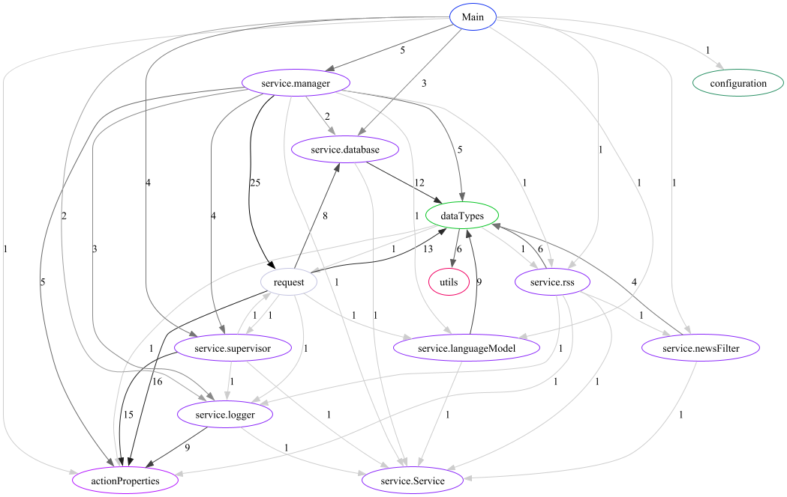
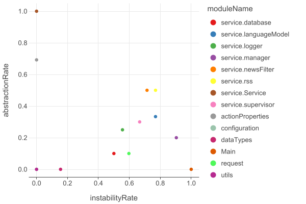

# LCHC (Low Coupling & High Cohesion)

Creates a Dependency graph and Abstraction Instability plot for any modules with Kotlin (and probably Java) files. 

### Afferent & Efferent:
Uses imports to determine relationship between modules

### Instability vs Abstractness:
Uses Interface/Abstract info as only Abstract indicator

### Use:
To run program simply use `fun main(args: Array<String>)` in Main.kt

`args` is a sequence of any number of threes:
1. absolute path to directory with files
2. depth for module creation (all files with package name of greater depth will be in one module)
3. unused depth for removing same prefix from module names

Files are saved in [results](results) folder (already contains example run results)

### Use Example:
[NewsSummarizer](https://github.com/Clu0D/NewsSummarizerBot) project structure contains
- prod.prog.service.logger.ConsoleLogger.kt
- prod.prog.service.Service.kt
- prod.prog.utils.MarkdownUtils.kt
- prod.prog.utils.XmlUtils.kt

for run with `args = ["D:\yourPath\NewsSummarizerBot\src\main\kotlin\service", "4", "2",
"D:\yourPath\NewsSummarizerBot\src\main\kotlin", "3", "2"]`

analyzed modules will be named
- service.logger
- service.Service
- utils